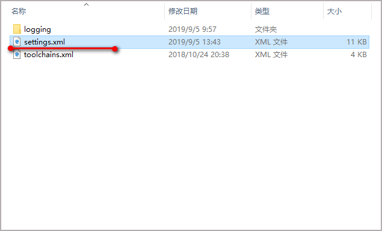
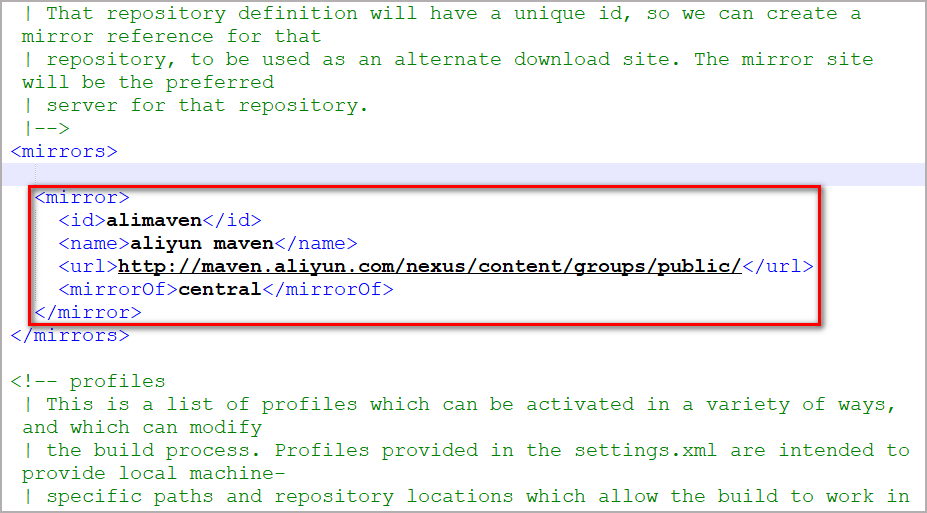
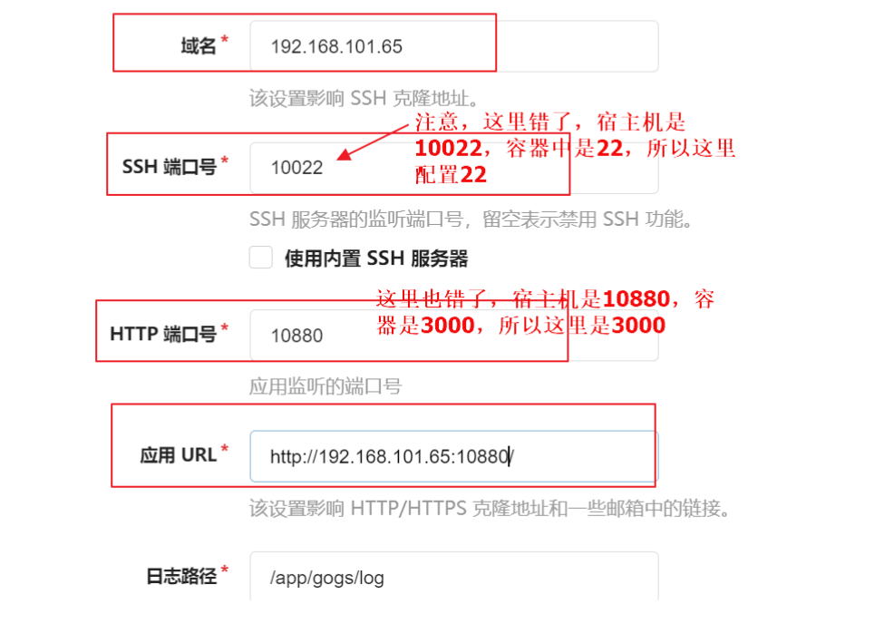
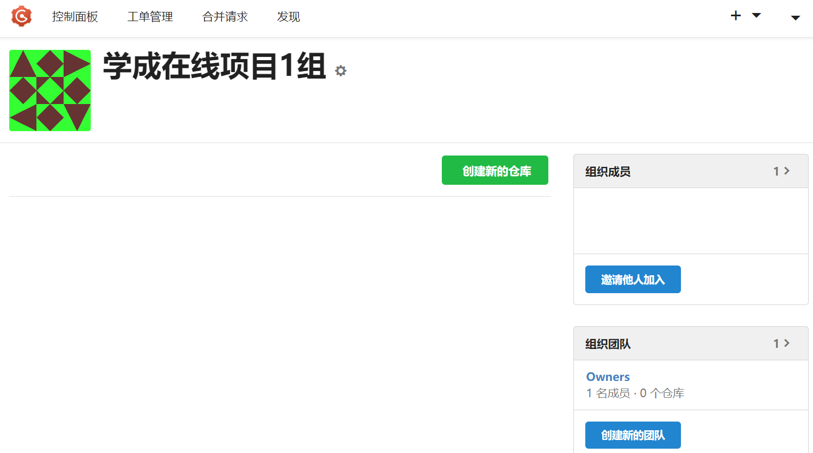
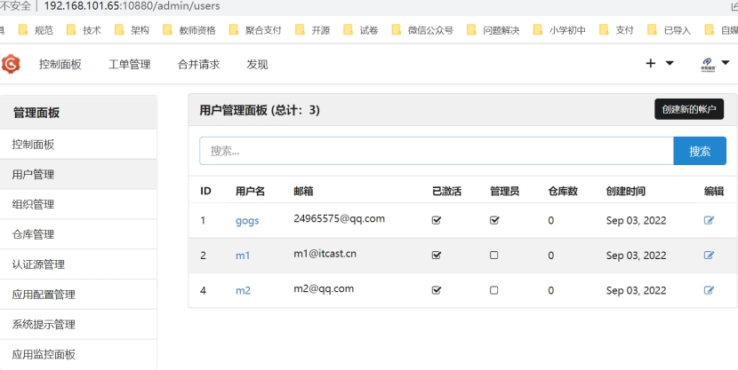

 

## 1. 开发工具配置

### 1.1 开发工具版本

服务端开发基础工具版本列表

|      开发工具      | 版本号         |
| :----------------: | -------------- |
|   IntelliJ-IDEA    | 2021.x以上版本 |
|        Java        | JDK-1.8.x      |
|       Maven        | 3.6.x以上版本  |
|       Mysql        | 8.x            |
| VMware-workstation | 15.x           |
|       CentOS       | 7.x            |
|   nacos-server-    | 1.4.1          |
|      rabbitmq      | 3.8.34         |
|       redis        | 6.2.7          |
|   xxl-job-admin:   | 2.3.1          |

​	项目应从基础 JDK 环境开始配起（基础），JDK环境变量配置和IDEA中配置JDK在此不再演示，需要学员自行进行配置，下面我们开始配置Maven环境。

### 1.2 IDEA环境配置

#### 1.3.1 IDEA配置环境编码


> 上图解释： 注释①：全局字符集设置     **`UTF-8`** 注释②：项目（Project）字符集设置    **`UTF-8`** 注释③：项目中的properties文件的编码集设置    **`UTF-8`**，后面的选项要勾选，这样中文字符会自动转化为16进制 		

 

#### 1.3.2 IDEA设置 Java 编译级别


> 上图解释： 注释①：设置 JDK 版本 注释②：设置 Java 编译级别

 

#### 1.3.4 IDEA自动导包设置

​	IDEA可以自动优化导入包，**但是有多个同名的类调用不同的包，必须自己手动Alt+Enter设置**， 下面可以通过设置来进行导包优化。


> 上图解释： 勾选上图面板中的两个选项

 

#### 1.3.5 IDEA代码提示忽略大小写

​	IDEA代码提示默认是区分大小写的，设置为提示忽略大小写，编译我们后期的开发。


> 上图解释： 注释①：在Code Completion选项面板中，去掉 Match case 前的选项 。

#### 1.3.6 设置代码注释模板

为了规范代码编写，一般在企业中会有自己的开发规范，开发规范中对代码的注释也会有一定的规范，比如下边的规范：

1、所有的类、接口、枚举类型、类的属性、方法的都强制要求编写注释，注释必须使用javadoc规范，使用/***/多行注释格式，不允许使用//xxx单行注释方式。比如下边的注释是不允许的：

```
//本类是一个测试类
//本类的功能是....
class T1{


}
```

2、所有的类、接口、枚举类型的注释要求写明作者、功能、日期。

3、代码如果修改需要修改相应的注释。

IDEA提供代码注释模板，方便团队规范代码 的注释。

下边配置IDEA上的代码注释：

1、注释中作者信息非常重要，可以通过虚拟机环境变量进行配置。

点击 Help->Edit Custom VM Options...打开idea.vmoptions文件，在最下面增加一行-Duser.name=用户名。

2、配置类、接口、枚举注释模板。

打开IDEA代码模板配置界面，分别配置Class、Interface、Enum.


注释模板内容如下：

```
 /**
 * @description TODO
 * @author ${USER}
 * @date ${DATE} ${TIME}
 * @version 1.0
 */
```

3、配置方法模板

打开Line Templates界面


首先添加一个Template Group：


输入名称，点击“OK”


在分组下添加代码模板，


 

点击“Change”,选择Java下的所有项目


填写模板的内容：

Abbreviation：输入*星号，在方法上输入反斜杠加星号自动生成注释。

Description：模板的描述

Template text: 模板内容

如下：

```
**
 * @description TODO
 * $params$
 * @return $return$
 * @author $user$
 * @date $data$ $time$
*/
```

点击Edit Variables编辑模板中用的变量


对于params方法的参数需要填写脚本，如下：

```
groovyScript("if(\"${_1}\".length() == 2) {return '';} 
else {
def result=''; 
def params=\"${_1}\".replaceAll('[\\\\[|\\\\]|\\\\s]', '').split(',').toList();
for(i = 0; i < params.size(); i++) {
if(i==0){result+='@param ' + params[i] + ' '}
else{result+='\\n' + ' * @param ' + params[i] + ' '}}; 
return result;}", methodParameters()
);
```

其它项目按照上图填写，点击“OK”。

 

 

 

 

 

### 1.3 Maven仓库配置

​    maven使用3.6以上的版本，课程资料中提供了apache-maven-3.8.6-bin.zip。

​	拷贝老师提供的maven仓库并解压，在本机中Maven的setting.xml文件中配置maven仓库位置，==**maven仓库的目录路径不要有特殊字符和中文（切记）**。==

#### 1.2.1 Maven中配置仓库位置

​	在Maven的conf目录中setting.xml文件中配置好仓库的位置并配置阿里云中央仓库地址。

> 解压下发的仓库 repository.zip 到本地硬盘


> 配置到conf目录中的setting文件中




 

> maven的中央仓库设置为阿里云服务



 

#### 1.2.1 IDEA中配置maven

  下边在idea中配置maven安装目录及本地仓库的位置。

​	在IDEA中： File --> Settings --> Build --> Build Tools --> Maven

> Maven项配置


 

> 下图中的 ① ② ③ 项要配置成自己本地中的路径位置


> 上图解释： 注释①：设置自己的maven路径（maven的根目录） 注释②：配置maven的settings文件的位置 注释③：配置maven的仓库位置

 

 

### 1.4 虚拟机配置

项目中用到的一些服务端软件如：MySQL、Nacos配置中心、RabbitMQ消息队列等通常会安装在企业局域网的服务器中，开发人员去远程连接它们。

如下图：


 

在教学中我们在自己的电脑上安装虚拟机，虚拟机代表了企业局域网中的服务器。

 

#### 1.4.1导入虚拟机

一般在企业中这些服务端软件不需要我们自己去安装，所以这里老师给大家提供了现成的虚拟机，大家需要安装VMware-workstation 16.x 虚拟机软件。


1、设置网络

点击 “编辑--》虚拟网络编辑器”配置网络地址，地址须与下图一致。


2、导入虚拟机

解压老师提供的虚拟机文件CentOS7-64-2.zip，进入解压后的文件架，双击"CentOS 7 64 位.vmx" 文件，选择复制虚拟机。

对此虚拟机的设置建议8G内存、4核CPU。


设置完成，启动虚拟机。

3、远程连接虚拟机

使用客户端工具远程 连接 虚拟机中的CentOS系统。

账号与密码为：root/centos

首先执行命令： systemctl start docker   启动docker。

执行启动脚本:   sh /data/soft/restart.sh 

查询docker容器：docker ps

如下图：


软件清单如下：

xxl-job-admin:2.3.1

minio:RELEASE.2022-09-07T22-25-02Z

 redis:6.2.7        

elasticsearch:7.12.1  

gogs

rabbitmq:3.8.34

nacos-server:1.4.1

mysql:8.0.26  

 

 

#### 1.4.2 安装虚拟机

如果如果电脑问题无法导入虚拟机需要手动安装虚拟机。

首先安装VMware-workstation 16.x 虚拟机软件。

本项目的服务端软件安装在CentOS7的操作系统下，所以需要安装一个CentOS7的虚拟机。

##### 1.4.2.1 下载CentOS7的安装包

下载地址：http://isoredirect.centos.org/centos/7/isos/x86_64/

CentOS7只提供了64位，这里选择DVD版本下载。

##### 1.4.2.2 安装CentOS7

在VMware中新建一个虚拟机，选择刚才下载的CentOS7的iso映像文件，然后一步一步进行安装，对CentOS安装过程不熟悉的同学可以参考B站黑马程序员的Linux视频进行学习。

##### 1.4.2.3 安装docker及软件

CentOS7的虚拟机安装成功后需要安装Docker，并在Docker中安装各各服务端软件：

1  xxl-job-admin:2.3.1：

```
下载镜像
docker pull xuxueli/xxl-job-admin:2.3.1

```

解压xxl-job-2.3.1.zip,找到 配置文件  application.properties


修改数据 库连接 配置如下：

```
spring.datasource.url=jdbc:mysql://192.168.101.65:3306/xxl_job2.3.1?useUnicode=true&characterEncoding=UTF-8&autoReconnect=true&serverTimezone=Asia/Shanghai

spring.datasource.username=root

spring.datasource.password=mysql

spring.datasource.driver-class-name=com.mysql.cj.jdbc.Driver
```

在centos上创建目录

创建/data/soft/xxl-job

创建/data/soft/xxl-job/applogs

将配置文件 拷贝到 /data/soft/xxl-job/application.properties

创建容器：

```
docker run -d -p 8088:8080 --name xxl-job-admin -v /data/soft/xxl-job/application.properties:/application.properties -v /data/soft/xxl-job/applogs:/data/applogs  -e PARAMS='--spring.config.loation=/application.properties' xuxueli/xxl-job-admin:2.3.1
```

 访问

http://192.168.101.65:8088/xxl-job-admin

账号密码：admin/123456

 

2   minio:RELEASE.2022-09-07T22-25-02Z

```
vi docker-compose.yml
脚本内容如下：
version: '3'
services:
  minio:
    image: minio/minio:RELEASE.2022-09-07T22-25-02Z
    container_name: minio
    ports:
      - 9000:9000
      - 9001:9001
    volumes:
      - /var/minio/data:/data
      - /var/minio/config:/root/.minio
    environment:
     MINIO_ACCESS_KEY: "minioadmin"
     MINIO_SECRET_KEY: "minioadmin"
    command: server /data --console-address ":9001" -address ":9000"
    restart: always
```

执行：docker-compose up -d 

 

3   redis        

创建一个文件夹

```
mkdir redis
```

进入redis文件夹中创建一个docker-compose.yml文件

```
cd redis vi docker-compose.yml
```

在docker-compose.yml中加入以下内容

```
version: '3' 
services: 
 redis: 
  container_name: redis 
  image: redis:5.0.7 
  restart: always 
  ports: 
   - 6379:6379 
  volumes: 
   - ./conf/redis.conf:/etc/redis/redis.conf:rw 
   - ./data:/data:rw 
  command: redis-server /etc/redis/redis.conf --appendonly yes 
  environment: 
   - TZ=Asia/Shanghai
```

redis文件夹下执行脚本

docker-compose up -d

 

4  elasticsearch:7.12.1  

docker-compose.yml内容如下：

```
version: '3'
services:
  elasticsearch:
    image: elasticsearch:7.12.1
    container_name: elasticsearch
    restart: always
    environment:
      - bootstrap.memory_lock=true
      - http.cors.enabled=true
      - http.cors.allow-origin=*
      - "discovery.type=single-node"
      - "ES_JAVA_OPTS=-Xms512m -Xmx512m"
    ulimits:
      memlock:
        soft: -1
        hard: -1
    volumes:
      - /data/soft/elasticsearch/plugins:/usr/share/elasticsearch/plugins
    ports:
      - 9200:9200
      - 9300:9300
  kibana:
    image: kibana:7.12.1
    container_name: kibana
    environment:
      - SERVER_NAME=kibana
      - ELASTICSEARCH_URL=http://192.168.101.65:9200
      - XPACK_MONITORING_ENABLED=true
    ports:
      - 5601:5601
    depends_on:
      - elasticsearch
    external_links:
```

因为在创建elasticsearch容器的时候，映射了目录，所以可以在宿主机上进行配置ik中文分词器

在去选择ik分词器的时候，需要与elasticsearch的版本好对应上

把资料中的 elasticsearch-analysis-ik-7.12.1.zip 上传到服务器上,放到对应目录（plugins）解压

下面我们需要把课前资料中的ik分词器解压缩，重命名为ik


最后将kibana切换为中文

在config/kibana.yml中添加i18n.locale: "zh-CN" 

操作如下：


 

5  gogs

docker pull gogs/gogs

mkdir -p /data/soft/gogs

 docker run --name=gogs -d -p 10022:22 -p 10880:3000 -v /data/soft/gogs:/data gogs/gogs

docker start gogs

 在mysql创建数据库gogs

 访问gogs安装软件

http://192.168.101.65:10880/

配置一系列的信息后开始安装

网上很多教程有错误，配置时注意下图中的错误点及正确的配置方法



安装完成自动跳转到 http://192.168.101.65:10880/

 

6  rabbitmq:3.8.34

7  nacos-server:1.4.1

8  mysql:8.0.26  

 

### 1.5 Git环境配置

#### 1.6.1 搭建个人Git环境

在发放的虚拟机中已经安装了Gogs 服务，Gogs和GitHub、GitLab一样都是Git托管平台，Gogs相比它们两者更轻量。Gogs的官网地址：https://gogs.io/

每位同学把虚拟上的Gogs服务作为远程仓库，每天练习的代码都需要上传至Gogs。

首先在个人电脑上安装Git，并在IDEA上进行配置。


进入Gogs找到项目仓库，仓库地址：http://192.168.101.65:10880/gogs/xuecheng-plus，如下图：


打开IDEA，从此仓库创建项目。


创建成功：


 

#### 1.6.2 搭建团队Git环境

在项目实战过程中，全班同学分成若干团队（小组），由于Leader（组长）在Gogs平台创建仓库，团队成员共享组长创建的仓库，协作开发。

通常一个项目由多个团队协作，如：研发团队、测试团队、产品团队等。

 1、首先创建一个组织

使用gogs/gogs账号登录gogs平台。

 

 

该组织通常以项目名命名，填写组织名称。 

 

 

创建成功，进入管理面板修改组织信息


点击编辑，填写组织名称。


 

修改成功，进入首页点击组织名称


进入组织首页



 

 

下边开始创建团队


 

 

假如创建研发团队，填写团队名称

 

选择权限等级，注意：这里即使选择了权限等级也需要在仓库管理中去管理协作者的权限。

 团队创建成功

 

 

团队创建成功下边开始创建成员账号 。

 首先在用户管理中添加账号分配给成员。

 

然后在下边的界面 中向团队添加成员

 

 团队和组织创建完成，下边创建仓库，进入组织，创建仓库。


填写仓库信息


 

创建成功，仓库地址：http://192.168.101.65:10880/xuecheng-plus-group1/xuecheng-plus-group1.git，如下


下边配置使用仓库的人员

点击“仓库设置”，


添加协作者，将团队成员的账号添加为协作者。

添加完成注意分配权限，如下图，通常测试人员为读取权限，开发人员为读写权限。


团队Leader需要将初始代码上传至Git仓库，团队成员通过Idea克隆一份项目代码，通过此仓库进行协作开发。

 

### 1.6 前端工具安装

#### 1.6.1 安装Visual Studio Code

我们在进行前后端连调时需要运行前端工程，下边我们安装前端工程运行的环境。

所需要的软件可以自行下载，也可从下发的开发工具目录获取。

首先安装nodejs v16.17.0

安装完成，查看版本号


前端工程采用Visual Studio Code工具运行，版本为1.70.2

安装后运行VScode，下边需要安装一些常用的插件。


在上图搜索栏中输入插件名称进行搜索，进行安装。


搜索出来点击插件信息，在右侧进行安装


如果未安装则有安装按钮，如果已安装则有卸载按钮。

下边的所要安装的插件。

 

  

 

 

#### 1.6.2 运行前端工程

解压课程资料包中的project-xczx2-portal-vue-ts.zip，这就是教学机构管理的前端工程。

解压后用vs code打开project-xczx2-portal-vue-ts目录。


 

然后打开终端窗口


运行 npm install -g yarn 安装yarn


安装完成，查看版本


 

如果在运行 yarn -v 时发现无法运行，显示如下提示信息。

 

可按下边的方法进行解决：

在win10桌面左下角的搜索栏中输入powershell，以管理员身份运行，弹出命令窗口

 

 

输入set-ExecutionPolicy RemoteSigned

输入y 此时，输入 get-ExecutionPolicy 

 

然后重启VS Code

在VS Code的左下角右键，打开npm脚本


 

打开后如下：


运行serve，启动前端工程 


 

开始启动前端工程


启动成功


 

发现出现http://localhost:8601/的地址说明启动成功，到此前端环境安装完成。

 

 

 

 

 

 

 

 

 

 

 